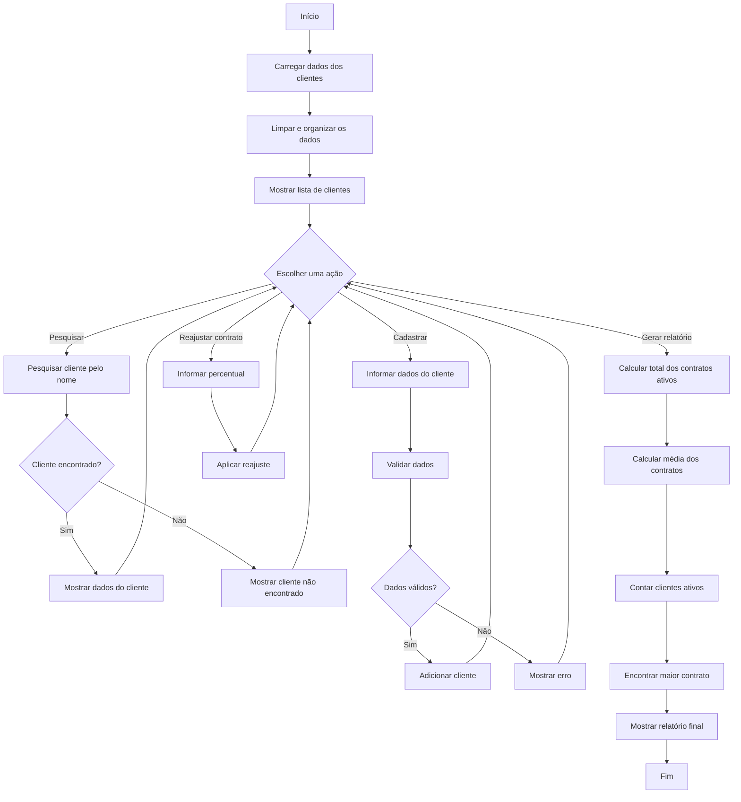

## Análise do Projeto - CRM SENAI

### Objetivo do Projeto.

Esse Projeto tem como objetivo criar um sistema simples de organização de dados dos clientes de uma empresa. A ideia é facilitar o trabalho da  equipe, deixando mais fácil visualizar e pesquisar os clientes, cadastrar novos clientes, conferir se os dados estão corretos e realizar cálculos dos contratos.

---

### O Problema dessa Empresa.

O Principal Problema dessa empresa são os dados desorganizados dos clientes já cadastrados. Isso precisa ser corrigido antes de serem apresentados no sistema. 

Um exemplo de como o sistema está os Nomes:
`ANA CLARA SILVA` Assim está errado pois está todo em maiúsculo.

Esse dado precisa virar:
`Ana Clara Silva` Esse nome precisa ficar dessa forma, apenas com as iniciais em maiúsculo, para ficar mais organizado.

Um exemplo de como está o CPF:
`123.456.789-00` O CPF está com os caracteres, o que pode dificultar o tratamento e a leitura desse numero pelo programa.

Esse dado precisa virar:
`12345678900` Dessa forma, o CPF fica somente com os números, facilitando o tratamento dos dados pelo código.

Além disso, o sistema precisa calcular informações dos contratos e permitir pesquisar clientes.

### Dados dos Clientes

Cada cliente terá cinco informações principais. Esses dados são necessários para que o sistema consiga cadastrar, organizar e realizar os cálculos dos contratos.

Cada Cliente terá as seguintes informações:

| Campo | Tipo de informação | Obrigatório |
|---|---|---|
| Nome | Texto | Sim |
| CPF | Texto | Sim |
| E-mail | Texto | Sim |
| Contrato | Número decimal | Sim |
| Ativo | verdadeiro ou falso | Sim |

----

### Requisitos Funcionais

#### RF01 -- Listagem de Clientes

O sistema deve permitir visualizar todos os clientes cadastrados, mostrando nome, CPF, e-mail, valor do contrato e situação.

#### RF02 -- Busca Por Nome

O sistema deve permitir pesquisar um cliente pelo nome e exibir seus dados. Caso o cliente não seja encontrado, o sistema deve informar ao usuário.

#### RF03 -- Cadastro de Cliente 

O sistema deve permitir inserir ou simular o cadastro de um novo cliente. tendo que validar o nome, e-mail, CPF e os valores de contrato.

#### RF04 -- Limpeza de Dados

O sistema deve conseguir remover espaços desnecessários dos nomes e caracteres de formatação dos CPFs.

#### RF05 -- Formatação

O sistema deve apresentar os nomes de forma organizada e os valores dos contratos no formato de moeda brasileira.

#### RF06 -- Resumo Financeiro

O sistema deve calcular a soma dos valores dos contratos dos clientes que estão ativos. e a média dos contratos cadastrados.

#### RF07 -- Alteração por referência

O sistema deve permitir aplicar um reajuste percentual no valor de um contrato, alterando o valor original.

#### RF08 -- Contagem de Clientes Ativos

O sistema deve informar a quantidade de clientes que estão ativos.

#### RF09 -- Relatório Final

O sistema deve apresentar a quantidade total de clientes, a quantidade de clientes ativos e o maior valor de contrato cadastrado.

----

### Requisitos não Funcionais.

#### RNF01 — Linguagem de programação

O sistema deve ser desenvolvido utilizando a linguagem PHP.

#### RNF02 — Tipagem

Os arquivos PHP devem utilizar `declare(strict_types=1)` e as funções devem possuir parâmetros e retornos tipados.

#### RNF03 — Organização do código

O sistema deve ser organizado em funções, separando o processamento dos dados da parte de apresentação.

#### RNF04 — Reutilização

As funções devem ser reutilizáveis, evitando a repetição de códigos e seguindo o princípio DRY.

#### RNF05 — Estrutura dos arquivos

O projeto deve possuir os arquivos `utilitarios.php`, `index.php`, `README.md` e uma pasta ou arquivo destinado aos testes.

#### RNF06 — Importação da biblioteca

O arquivo `index.php` deve utilizar require_once para importar a biblioteca de funções.

#### RNF07 — Armazenamento dos dados

Os dados dos clientes devem ser simulados utilizando arrays, sem a necessidade de banco de dados.

#### RNF08 — Interface

Os resultados devem ser apresentados de forma organizada em uma tela HTML, facilitando a visualização das informações dos clientes.

#### RNF09 — Manutenção

O código deve ser organizado de forma que seja fácil realizar alterações e correções nas funções sem precisar modificar várias partes do sistema.

---

### Fluxograma da Aplicação

O fluxograma mostra as principais etapas do sistema, desde o carregamento dos clientes até a apresentação do relatório final.

---

### Como funciona o Fluxograma

O fluxograma mostra o passo a passo de como o sistema vai funcionar.

Primeiro, o sistema começa carregando os dados dos clientes e organizando essas informações. Depois, os clientes são mostrados na tela e o usuário pode escolher o que deseja fazer.

Se o usuário quiser **pesquisar um cliente**, ele informa o nome e o sistema verifica se esse cliente está cadastrado. Se encontrar, os dados são mostrados. Caso não encontre, aparece uma mensagem informando que o cliente não foi encontrado.

Se o usuário quiser **cadastrar um cliente**, ele deve informar os dados necessários. O sistema verifica se as informações estão corretas. Se estiverem corretas, o cliente é adicionado. Se tiver algum problema, o sistema mostra uma mensagem de erro.

Também é possível **aplicar um reajuste no contrato**, informando a porcentagem que será aplicada ao valor atual.

Por último, o sistema pode **gerar o relatório**, calculando o total dos contratos ativos, a média dos contratos, a quantidade de clientes ativos e o maior contrato cadastrado.

# Relatório Final — CRM SENAI

## 1. Introdução

O projeto CRM SENAI foi criado para organizar os dados dos clientes de uma empresa. O sistema permite visualizar, pesquisar e cadastrar clientes, além de validar os dados e realizar cálculos dos contratos.

## 2. Desenvolvimento

O grupo dividiu as tarefas entre os integrantes. Uma pessoa ficou responsável pelo `utilitarios.php`, criando as funções do sistema, e outra pelo `index.php`, criando a parte da tela e fazendo a integração.

Depois que cada parte foi feita, juntamos os arquivos usando o **Merge no GitHub colaborativo**. A integração foi feita seguindo os requisitos que foram definidos na análise e no README.

## 3. Funcionamento

O sistema permite:

* listar os clientes;
* pesquisar pelo nome;
* cadastrar clientes;
* validar os dados;
* organizar nomes e CPFs;
* formatar os valores dos contratos;
* calcular os contratos ativos e a média;
* aplicar reajustes;
* contar os clientes ativos;
* mostrar o maior contrato.

## 4. Testes

Depois de juntar os arquivos, foram realizados os testes para verificar se o sistema estava funcionando corretamente.

Foram testados casos como cadastro, validação de CPF, campos vazios, busca de cliente, contrato igual a zero e reajuste.

**O sistema passou em todos os testes realizados e está funcionando corretamente.**

## 5. DRY

O princípio DRY foi utilizado através das funções criadas no `utilitarios.php`. Assim, não foi necessário repetir o mesmo código várias vezes, deixando o projeto mais organizado e fácil de modificar.

## 6. Conclusão

O projeto conseguiu cumprir o que foi proposto. Depois da integração dos arquivos e dos testes, o sistema ficou funcionando corretamente e as principais funcionalidades foram atendidas.
